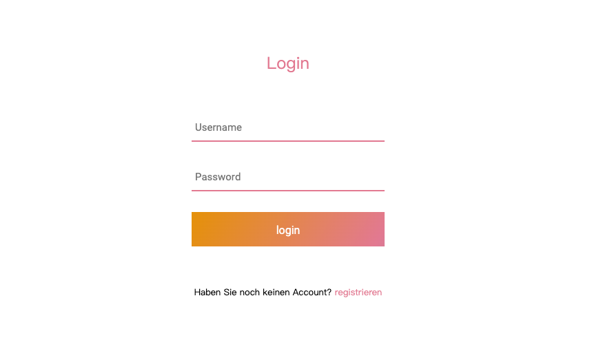

# 14. Anmelden und Registrieren

## 14.1. Aussehen

 

## 14.2 Detail Komponente Konstruktor

1. LoginView.vue: Banner
2. Registrieren.vue: Detail
3. index.vue: exportieren

## 14.3 Code

```vue
<template>
<div>
  <form class="login-form">
        <h1>Login</h1>
        <div class="txtb">
          <input type="text" v-model="Username" placeholder="Username">
        </div>

        <div class="txtb">
          <input type="password" v-model="password" placeholder="Password">
         
        </div>

        <my-btn :title='"login"' :type="submit" :theme="'color'" />
        <div class="bottom-text">
          Haben Sie noch keinen Account? <router-link to="/registrieren">registrieren</router-link>
          <router-view></router-view>
        </div>
  </form>
</div>
</template>

<script>
export default {
name:"LoginView",
data() {
    return {
        Username:'',
        password:''
    }
},
components:{
 
}
}
</script>

<style lang="scss" scoped>
 body{
 width: 100%;
   background-color:pink;
 }

.login-form{
  width: 360px;
  height: 580px;
  padding: 80px 40px;
  border-radius: 10px;
  position: absolute;
  left: 50%;
  top: 50%;
  transform: translate(-50%,-50%);
}

.login-form h1{
  text-align: center;
  margin-bottom: 60px;
  font-size: 1.5rem;
}

.txtb{
  border-bottom: 2px solid var(--themeColor);
  position: relative;
  margin: 30px 0;
}

.txtb input{
  font-size: 15px;
  color: #333;
  border: none;
  width: 100%;
  outline: none;
  background: none;
  padding: 0 5px;
  height: 40px;
}

.txtb span::before{
  content: attr(data-placeholder);
  position: absolute;
  top: 50%;
  left: 5px;
  color: var(--bgColor);
  transform: translateY(-50%);
  z-index: -1;
  transition: .5s;
}

.txtb span::after{
  content: '';
  position: absolute;
  width: 0%;
  height: 2px;
  background: linear-gradient(120deg,var(--orange),var(--themeColor));
  transition: .5s;
}

.focus + span::before{
  top: -5px;
}
.focus + span::after{
  width: 100%;
}


.bottom-text{
  margin-top: 60px;
  text-align: center;
  font-size: 13px;
  &.bottom-text a{
      color: var(--themeColor);
  }
}

</style>
```