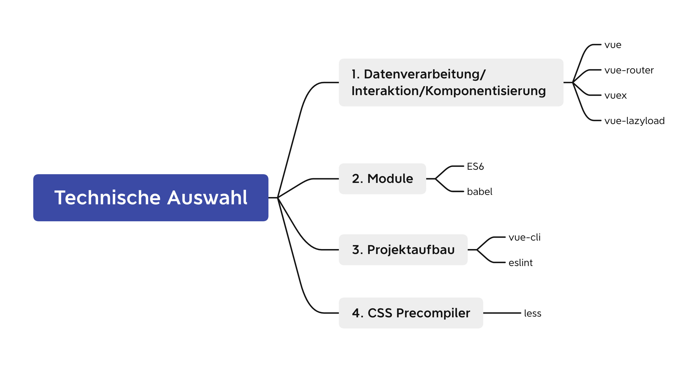

# Hundfutter Web Shop

## 1. Projektbeschreibung
Die Augen sagen mehr als tausend Worte. Wissenschaftliche Studien zeigen, dass die Blickrichtung in die die Person auf dem Bild schaut dazu führen kann, dass Menschen unbewusst in die gleiche Richtung schauen. Dieses Phänomen ist in der Wirtschaft weit verbreitet, um mehr Produkte zu verkaufen. Auf dieser Grundlage habe ich diese Website vom Design bis zur Entwicklung gemacht. Beschreibungen:

1. Dieses Projekt ist eine Online-E-Commerce-Web-App 

2. Einschließlich Homepage, Suchliste, Produktdetails, Warenkorb, Benutzerregistrierung & Login und andere Untermodule

3. Verwenden Sie die neuesten und heißesten Front-End-Technologien wie Vue  + ES6++ Webpack, Route Lazy Loading, zwischengespeichert mit Keep-Alive, Bild lazy loading u.s.w.

4. Entwickeln Sie in einem modularen, komponentenbasierten und technischen Modus

## 2.Projektfunktionsschnittstelle

  

Beschreibung: Voll funktionsfähige Schnittstelle zum Ausführen der endgültigen Version des Projekts

## 3.Technische Auswahl



## 4. Vue Route


[zur Website](https://hundfutter.netlify.app/#/home)

## 5. Performance
### 1. Bilder lazyload
#### 1) vue-lazyload herunterladen
```
npm install -S vue-lazyload
```

#### 2) Bilder importieren und konfigurieren

main.js

```js
import VueLazyload from 'vue-lazyload';

Vue.use(VueLazyload)
```


#### 3) code
    produkt.vue
    ```vue
    <div>
        
      </div>
    ```


### 2. vue-router lazyloading

1. code
```js
Home = () => import('@/pages/Home')
```

### 3. SVG Loader
```vue
 npm install vue-svg-loader@0.16.0",
 npm install vue-template-compiler@2.6.14
```

### 4. zwischengespeichert mit Keep-Alive
```vue
 {
    path: '/produkt',
    name: 'produkt',
    meta:{
      keepAlive: true 
    },
    component: ProduktView
  }
```

## 6. Effizienzverbesserung
### gemeinsame Komponente
Button in verschiedenen Stilen
<br>
  
<br>
 
<br>
 


```vue
<template>
  <div>
    <button :type="type" :class="[icon, this.theme]" :color="color" :action="action">{{ title }}</button>
  </div>
</template>

<script>
export default {
  name:'my-btn',
  data(){
    return {
   
    }
  },
  props:{
    title:{
      type:String,
      default:''
    },
    type:{
      type:String,
      default:'submit'
    },
    theme:{
      type:String,
      default:()=>'button'
    },
    color:{
      type:String,
      default:'black'
    },
    icon:{
      type:String,
      default:' ' 
    },
    action:Function,
  },
  methods:{
   
  }
}
</script>
<style lang="scss">

 .color{
  font-size: 1rem;
  display: block;
  width: 100%;
  min-width: 100px;
  height: 50px;
  border: none;
  background: linear-gradient(120deg,var(--orange),var(--themeColor),var(--blue));
  background-size: 200%;
  color: #fff;
  outline: none;
  cursor: pointer;
  transition: .5s;
}

.color:hover{
  background-position: right;
} 

.button {
  background: rgba(255, 255, 255, 0.8);
  font-size: 1rem;
  margin-bottom: 1rem;
  padding: 0.5rem 0.5rem;
  border-radius: 1rem;
  border: 1px solid #D4D3E8;
  font-weight: 700;
  display: flex;
  align-items: center;
  justify-content: center;
  width: 100%;
  min-width: 70px;
  min-height: 40px;
  color: var(--themeColor);;
  box-shadow: 0px 2px 2px var(--themeColor);;
  cursor: pointer;
  transition: .2s;
}

.button:active,
.button:focus,
.button:hover {
  border-color: var(--themeColor);
  outline: none;
  background-color: var(--white);
}

.blur {
  border-color: var(--themeColor);
  // color: #fff;
  box-shadow: 0 0 40px 40px var(--themeColor) inset, 0 0 0 0 var(--themeColor);
  transition: all 150ms ease-in-out;
  
  &:hover {
    box-shadow: 0 0 10px 0 var(--themeColor) inset, 0 0 10px 4px var(--themeColor);
  }
}
</style>

```

```vue
<my-btn :title="'MEHR'"  @click.native="showProdukte"> </my-btn>
```

 

 

 

 


 